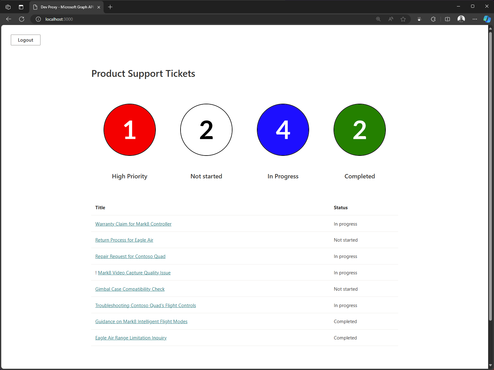

# Improve your app security when calling Microsoft Graph

> [!IMPORTANT]
> This sample has been moved to the [Proxy Samples](https://github.com/pnp/proxy-samples/tree/main/samples/improve-app-security-graph) repository.

## Summary

This sample demonstrates how to use Dev Proxy to improve your app security when calling Microsoft Graph API.

